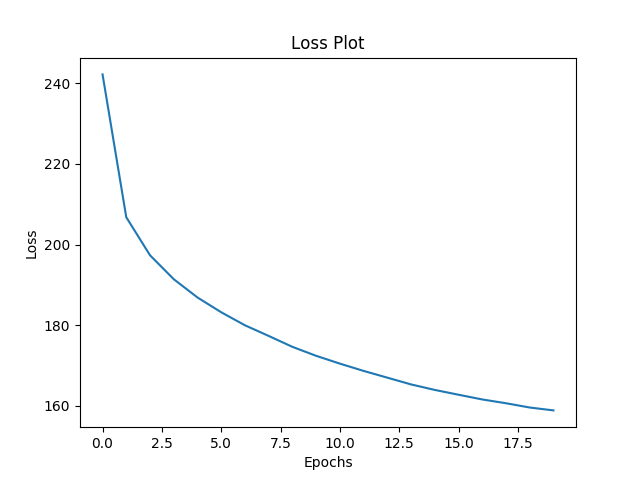
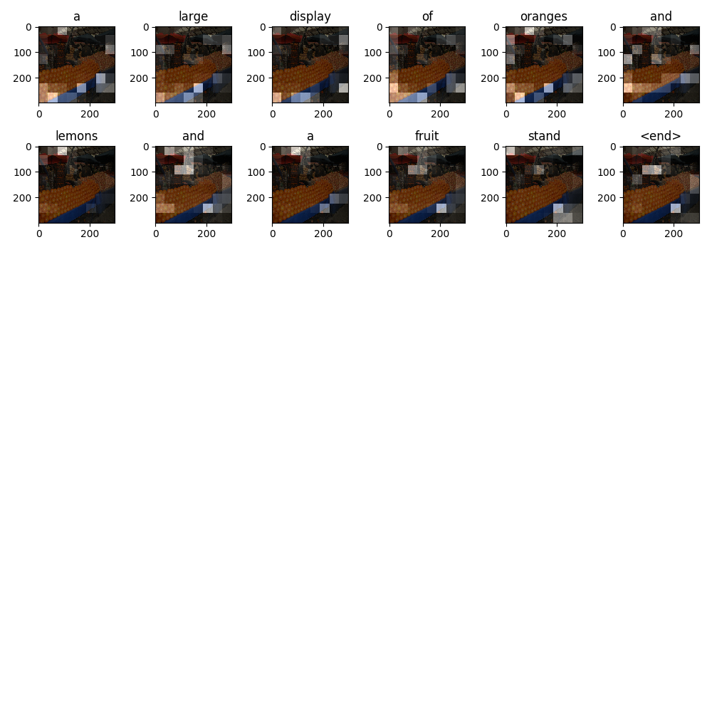
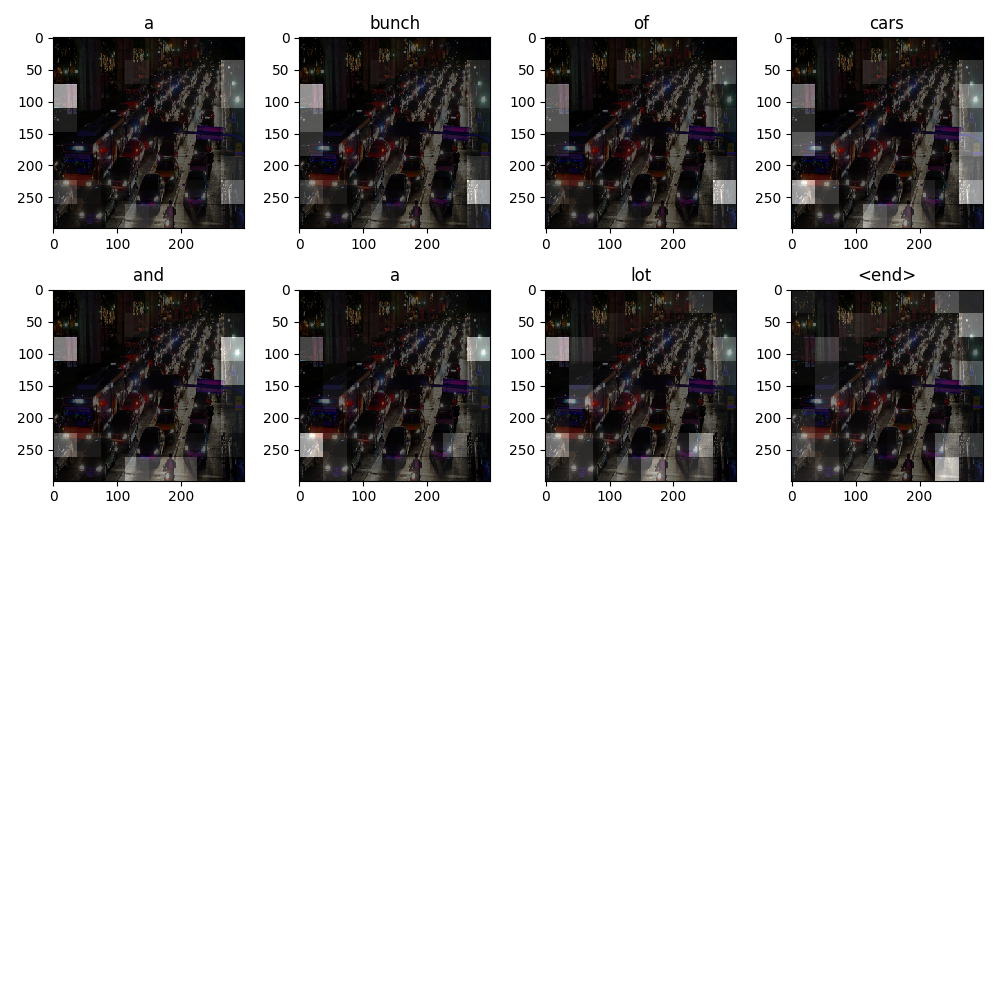
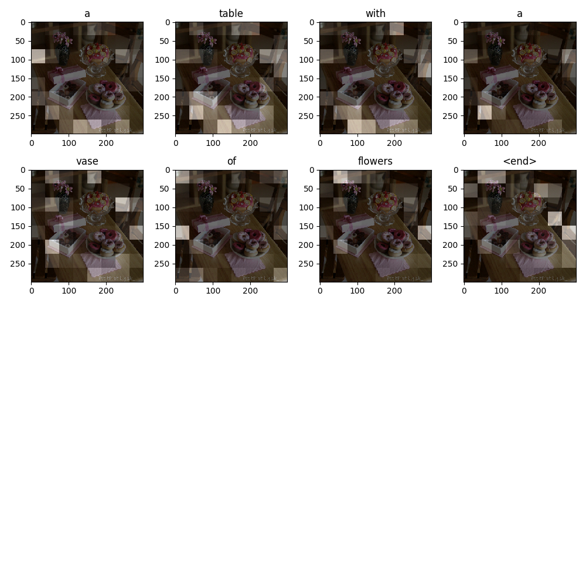
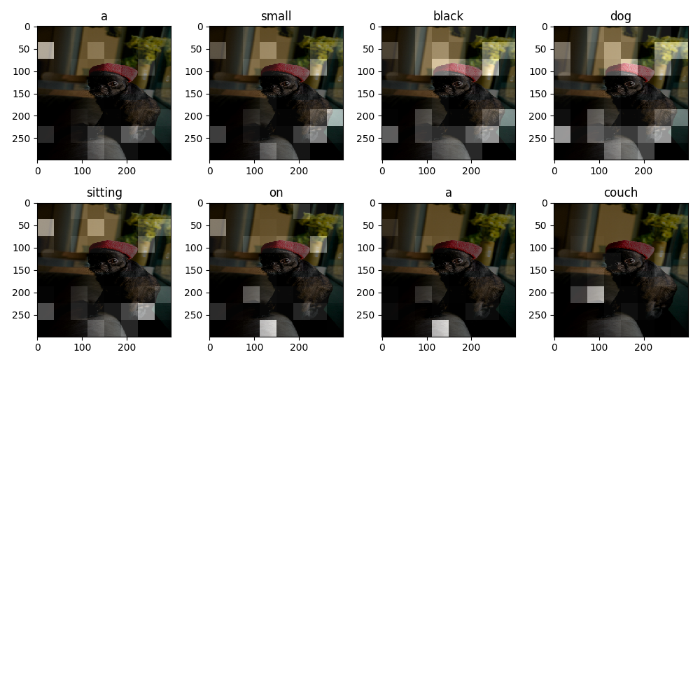
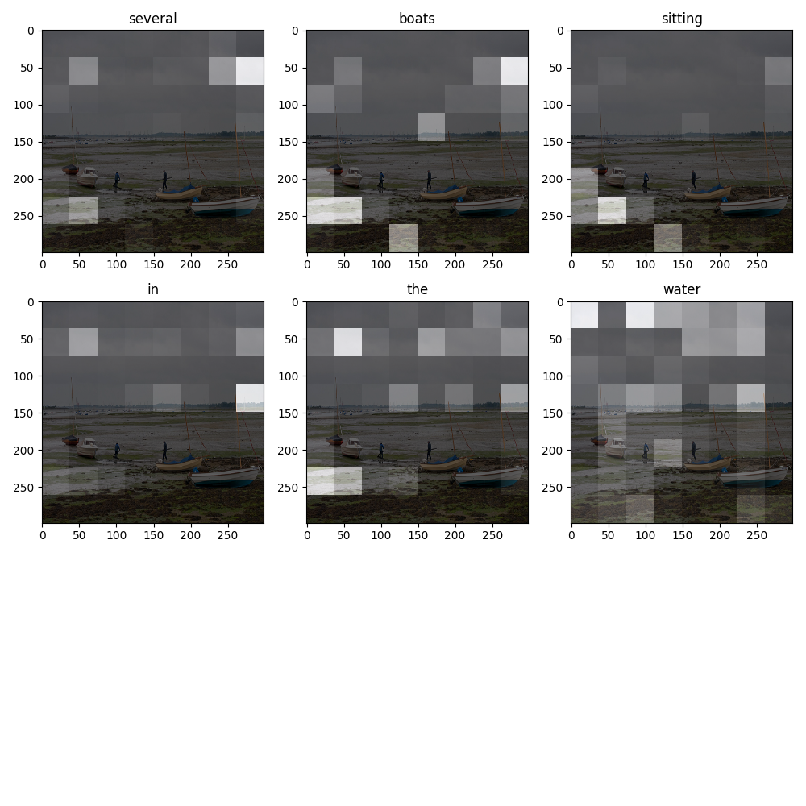

# Image_to_Text

Taking the image description task on the MS-COCO data set as an example, the template code of Image_to_Text is shown.

以在MS-COCO 数据集上的图片描述任务为例，展示了Image_to_Text的模板代码。

## Main principle

The model consists of CNN-Encoder and RNN-Decoder. The CNN-Encoder is used to extract the information of the input image to generate the intermediate representation H, and then use RNN-Decode to gradually decode the H (using Bahdanau Attention) to generate a text description corresponding to the image.

模型由CNN-Encoder和RNN-Decoder组成，首先使用CNN-Encoder提取输入图片的信息生成中间表示H，然后使用RNN-Decode对H逐步解码（使用了BahdanauAttention）生成图片对应的文本描述。

```
Input: image_features.shape (16, 299, 299, 3)
---------------Pass by cnn_encoder---------------
Output: image_features_encoder.shape (16, 64, 256)

Input: batch_words.shape (16, 1)
Input: rnn state shape (16, 512)
---------------Pass by rnn_decoder---------------
Output: out_batch_words.shape (16, 5031)
Output: out_state.shape (16, 512)
Output: attention_weights.shape (16, 64, 1)
```

## Require

+ python 3+
+ tensorflow version 2

## Code usage

### 1. Prepare Data

```python
python dataset_utils.py
```

### 2. Train Model

```python
python train_image2text_model.py
```

### 3. Model Inference

```python
python inference_by_image2text_model.py
```

## Experimental result

> EPOCHS=20

**loss**



**inference_image_caption outputs**








